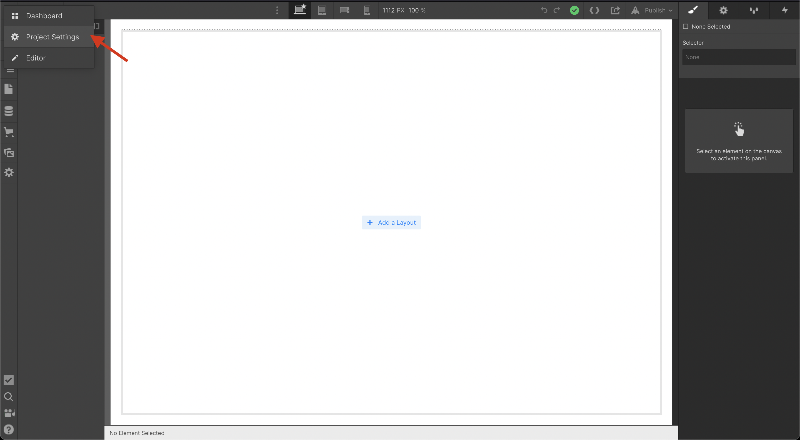

# Swetrix to Webflow integration
After you sign up on Swetrix and create a new project, the only thing left is to add it to your website.
If you're curious what data the tracking script collects, open our [documentation](https://swetrix.com/docs#docs-tv) and read the `API -> trackViews` section.

## Installation
1. Log in to your Webflow account.
   
2. Open up your project, go to the `Project Settings > Custom Code` section:


3. In the `Head code` section you need to add the following:
```html
<script src="https://swetrix.org/swetrix.js" defer></script>
```

4. In the `Footer code` section you need to add the following:
```html
<script>
  document.addEventListener('DOMContentLoaded', function () {
    swetrix.init('YOUR_PROJECT_ID')
    swetrix.trackViews()
})
</script>

<noscript>
  
</noscript>
```

**Do not forget to change YOUR_PROJECT_ID to your actual project id!**

## Check your installation
After installing Swetrix tracking script, go to your website and visit some pages.\
Within a minute you should be able to see new pageviews being added to your project's dahsboard.\
**Important: Custom scripts will only appear on the published Webflow site.**
